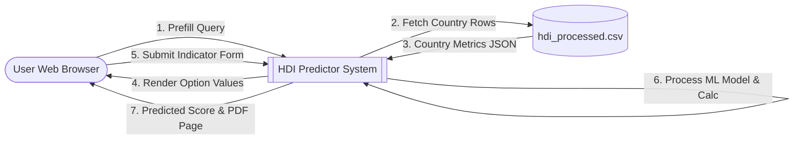
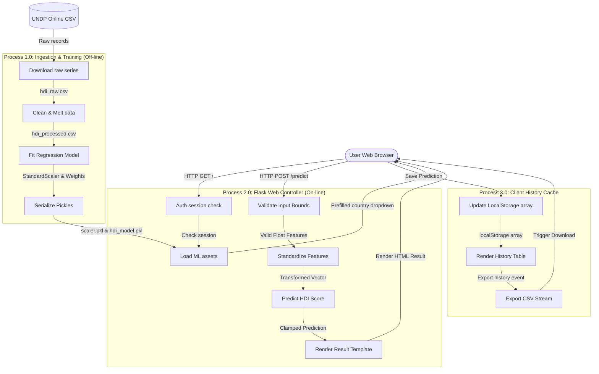

# Data Flow Diagram (DFD)

This document visualizes the movement of data throughout the HDI Predictor application, mapping inputs from the user interface, through the Flask routing, into the machine learning predictors, and back to the client templates.

---

## 📈 DFD Level 0 (Context Diagram)

---

## 📉 DFD Level 1 (Process Diagram)

