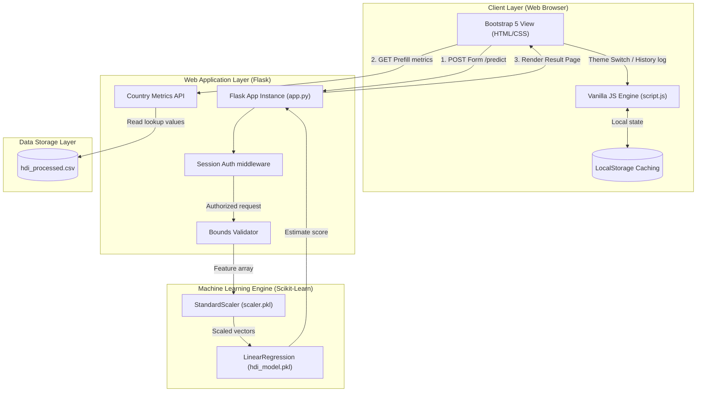

# Solution Architecture Specification

This document details the software architecture layers and interaction protocols behind our HDI Predictor system.

---

## 🏛 Solution Layers Diagram

---

## 🔗 Architecture Component Descriptions

1. **Authentication Session Guard:** Intercepts requests using `app.before_request`. Validates if `session['logged_in']` is active. Redirects to `/login` if unauthenticated.
2. **Bounds Validator:** Checks incoming query features (Life Expectancy, Schooling, GNI) against predefined ranges. Rejects out-of-bounds metrics with HTTP 400.
3. **ML Pickles Pipeline:**
   * `scaler.pkl`: Restores mean and variance offsets from the training dataset.
   * `hdi_model.pkl`: Houses the weights matrix, multiplying standardized vectors to predict final index scores.
4. **Local History Database:** JavaScript-controlled LocalStorage caching. Encapsulates predictions as JSON dictionaries and appends them to a list, avoiding SQL database setups.
