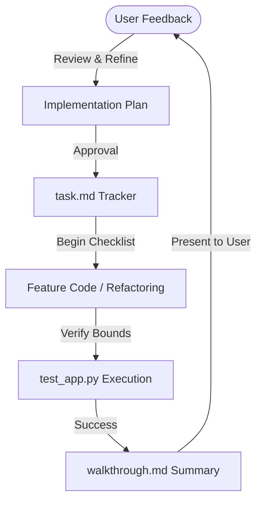

# Communication & Collaboration Plan

This document details the communication strategy, task allocation framework, and feedback integration loops for our development team.

---

## 📞 1. Communication Tools & Cadence

To ensure smooth pair programming and continuous integration, we align on these practices:
* **Asynchronous Updates:** Git commits include clear messages (e.g. `feat: added before_request session auth gate in app.py`).
* **Pair Programming:** Iterative code adjustments with the AI compiler via structured prompts.
* **Testing Logs:** Terminal outputs are piped directly into task log URIs, ensuring debugging history is fully preserved.

---

## 🔀 2. Feedback Integration Loop

---

## 📋 3. Task Ownership Mapping

* **UI/UX & Client Logic:** UI Designer (responsible for range syncing, dynamic autofills, theme changes, localStorage history).
* **ML Modeling & Pipeline:** ML Engineer (responsible for cleaning dataset, generating scatter plots, fitting linear metrics, serializing pickles).
* **WSGI Backend Server:** Backend Developer (responsible for session authentications, routing, and error handlers).
* **Quality Assurance:** QA Tester (responsible for unit tests coverage, input bounds testing).
