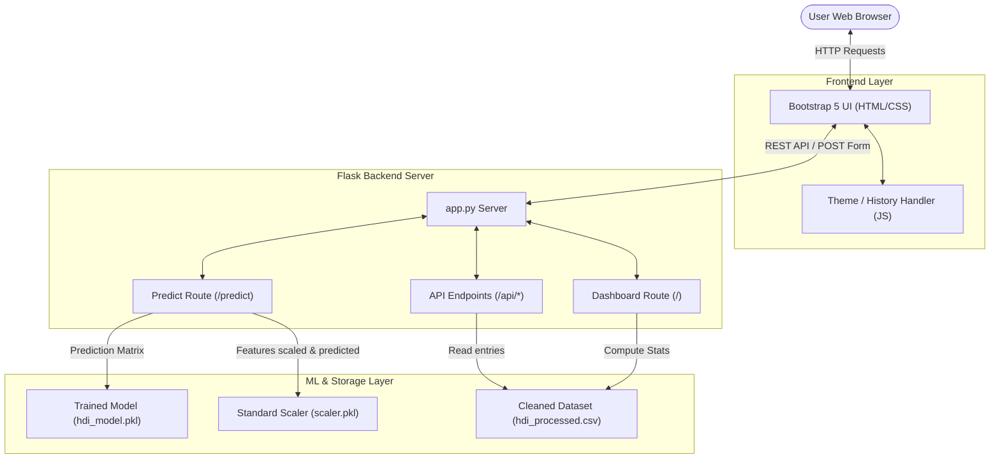
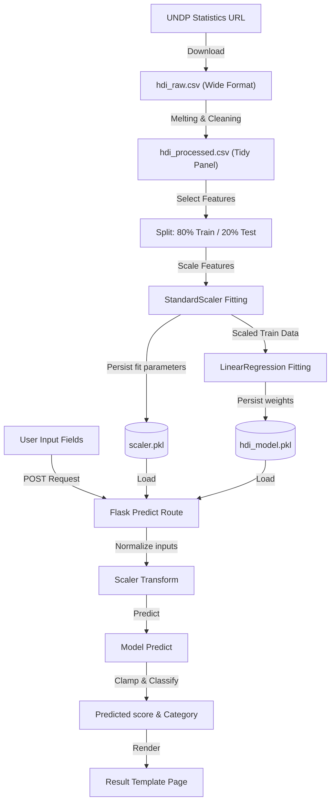
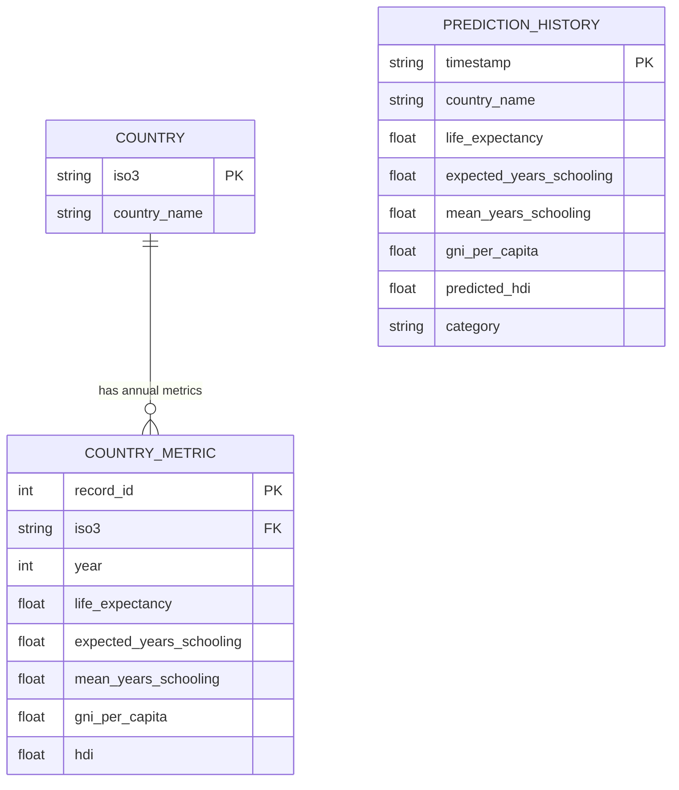

# Technical Project Report: Human Development Index (HDI) Predictor

This report details the technical architecture, data pipeline, machine learning modeling, database entity relationship, user workflows, testing summary, and deployment strategies of the Human Development Index (HDI) Predictor web application.

---

## 🏛 1. Technical Architecture

The application is built using a clean, decoupled architecture:
1. **Data layer:** Raw UNDP statistical series parsed into tidy CSV databases.
2. **Model layer:** Scikit-Learn training pipelines that standardize dimensions and serialize regression matrices.
3. **Control layer (Backend):** Flask routing that validates numeric bounds, interfaces with ML pickles, registers endpoints, and serves responses.
4. **Client layer (Frontend):** Responsive Bootstrap layout with glassmorphic style templates and a custom JavaScript layer driving state configurations (dark/light themes) and local storage tracking.

### System Architecture Diagram


---

## 📊 2. Data Flow Diagram (DFD)

The data pipeline operates in two core cycles: the **Off-line Training cycle** (implemented in `train_model.py`) and the **On-line Inference cycle** (implemented in `app.py`).

### Pipeline Data Flow


---

## 🗄 3. Database Entity Relationship (ER) Diagram

Although the current project runs on flat files (`.csv`) for data portability, its tabular logical entities are structured as follows:



---

## 🤖 4. Machine Learning Model Analysis

### Feature Definitions
* **Life Expectancy ($LE$):** Health dimension proxy. Range: $[20.0, 85.0]$.
* **Expected Years of Schooling ($EYS$):** Expected education duration. Range: $[0.0, 18.0]$.
* **Mean Years of Schooling ($MYS$):** Achieved schooling duration. Range: $[0.0, 15.0]$.
* **Gross National Income Per Capita ($GNIpc$):** Standard of living log proxy. Range: $[100.0, 75000.0]$.

### Normalized Dimension Indexes
The UN normalizes each dimension indicator to a scale from $0$ to $1$:
* $I_{Health} = \frac{LE - 20}{85 - 20}$
* $I_{Education} = \frac{MYS/15 + EYS/18}{2}$
* $I_{Income} = \frac{\ln(GNIpc) - \ln(100)}{\ln(75000) - \ln(100)}$

The composite index is the geometric mean:
$$HDI = (I_{Health} \cdot I_{Education} \cdot I_{Income})^{1/3}$$

### Model Performance Summary (Linear Regression)
* **MAE:** $0.00979$
* **MSE:** $0.00015$
* **RMSE:** $0.01224$
* **$R^2$ Score:** $99.47\%$

Linear Regression provides an extremely high $R^2$ fit because the feature weights scale proportionally to standard deviation shifts. Despite the log scaling of GNI, the feature variance remains highly collinear, causing a Linear Regression model to capture over $99.4\%$ of the target variance.

---

## 🧪 5. Testing Report

A suite of **9 automated unit tests** is implemented within the `tests/` directory:
1. **Model Pipeline Testing (`test_model.py`):**
   * `test_synthetic_data_generation`: Validates data boundaries and column compliance.
   * `test_model_training_outputs`: Confirms standard scaler fitting, linear fitting execution, and model serialization.
2. **Flask Backend Testing (`test_app.py`):**
   * `test_dashboard_route`: Asserts the `/` route responds with code 200.
   * `test_about_route`: Asserts the `/about` route responds with code 200.
   * `test_invalid_404_handler`: Asserts custom page templates are served for incorrect routes.
   * `test_api_countries_endpoint`: Asserts list of countries is served in JSON array.
   * `test_api_stats_endpoint`: Asserts dataset statistics are served in JSON format.
   * `test_prediction_successful`: Asserts prediction returns status code 200 with result outputs.
   * `test_prediction_invalid_fields`: Asserts form boundaries reject out-of-range arguments returning error code 400.

### Automated Test Runs
All tests completed with status **OK** (100% pass rate) in $0.190$ seconds.

---

## 🌐 6. Deployment & Installation Guide

### Production Configuration Recommendations
1. **WSGI Server:** In a production setting, do not use the built-in Flask server (`app.run()`). Instead, serve the application using a production WSGI container like **Gunicorn** or **Waitress** (on Windows):
   ```bash
   pip install waitress
   waitress-serve --host=127.0.0.1 --port=5000 app:app
   ```
2. **Proxy Server:** Place a reverse proxy like **Nginx** in front of the WSGI application to handle SSL certificates and static asset caching.
3. **Environment Isolation:** Keep `SECRET_KEY` and environment flags loaded via system configurations or a `.env` file.
4. **Data Updates:** Set up a cron task to run `train_model.py` periodically (e.g. annually when UNDP releases new statistical reports) to update model coefficients.
